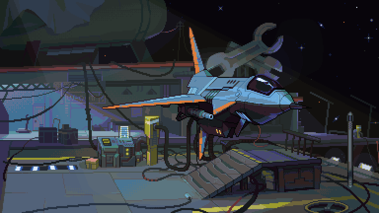

  
  

  <!--I used HTML code to center the gif-->

---

Robotics enthusiast and an aspiring Robotics Engineer.
All about building robot designs and problem-solving.

About Me
---

* **FIRST Global Alumni & Mentor** 🤖
* **Electrical & Electronic Engineering student** ⚡
* **STEM Instructor** 🔭

My Skills
---

Learning
---

Lets Connect
---

Whether you're into robotics, STEM or just love automation, let’s team up!

 
<!-- I used HTML code to leave a blank line-->

