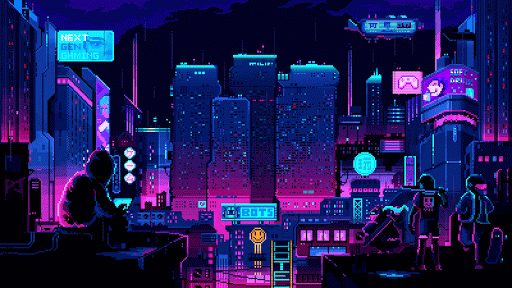

---

## Hi there! I'm Ahmed Hussein

<!------I think one # is too big -->
<!--- The setext will take more space and it will ruin my format 😂-->
<!---used pocutuation ! because it looks fun -->

**Robotics enthusiast** and an aspiring **Robotics Engineer**.
All about building robot designs, solving problems.

### About Me!

<!--- used pocutuation ! because it looks fun-->

* 🤖 **FIRST Global Alumni & Mentor** | Guiding and inspiring young roboticists.
* ⚡ **Electrical and Electronic Engineering student** | Exploring circuits, automation, and tech.
* 🔭 **STEM Advocate** | Empowering minds with science and technology.

---

### My Skills

 

### Learning

---

### Lets Connect

Whether you're into robotics, STEM education, or just love geeking out over tech, let’s team up and make something awesome!

>*Dream Big . . . Build Bigger*

